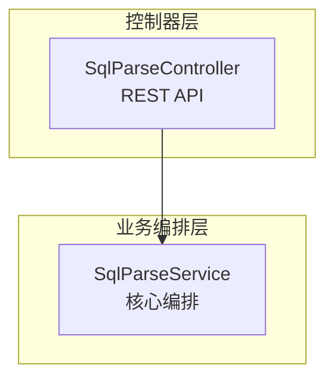

# RepoWiki 生成规范

## 目标

为用户指定的项目生成一套完整的 RepoWiki 文档，输出到项目根目录下的 `.repowiki/` 中：

- 多维度覆盖：项目概述、核心架构、数据模型、API/接口、配置管理、扩展开发、监控运维、测试策略、开发者指南、快速开始等。
- 每个主题一个目录（catalog），目录下包含一个聚合主文档和 4-6 个子文档。
- 所有文档使用统一的 Markdown 模板、引用规范、Mermaid 图表规范和来源标注。
- 同时生成 `meta/repowiki-metadata.json` 元数据和可选的 `knowledge/` 知识模块。
- 为了展示条理清晰且方便阅读，请在文件夹或文件命名前统一添加两位数字序号前缀（01、02…），固定阅读顺序。

## 触发条件

当用户表达以下任意意图时，必须调用本 skill：

- “按 repowiki 的结构生成文档”
- “像 repowiki 那样输出项目 wiki”
- “为这个项目创建 repowiki”
- “生成项目文档集 / 仓库 wiki”
- “按照之前的目录大纲写文档”
- 任何提到 repowiki、项目 wiki、结构化项目文档、源码引用文档的表述

## 输出目录结构

RepoWiki 统一输出到项目根目录下的 `.repowiki/{locale}/` 中。默认 locale 为 `zh`（中文）。

```
{project-root}/.repowiki/
└── zh/
    ├── meta/
    │   └── repowiki-metadata.json      # Wiki 目录结构、prompt、关系
    ├── content/                         # 面向读者的主题文档
    │   ├── 项目概述/
    │   │   ├── 项目概述.md             # 聚合主文档
    │   │   ├── 项目介绍.md
    │   │   ├── 技术架构概览.md
    │   │   ├── 核心特性.md
    │   │   └── 应用场景.md
    │   ├── 核心架构设计/
    │   │   ├── 核心架构设计.md
    │   │   ├── 服务编排层.md
    │   │   ├── LLM集成层.md
    │   │   ├── 传统引擎客户端.md
    │   │   └── 复杂度检查器.md
    │   ├── 数据模型设计/
    │   │   ├── 数据模型设计.md
    │   │   ├── 请求响应模型.md
    │   │   ├── 血缘关系数据模型.md
    │   │   └── LLM验证模型.md
    │   ├── API参考文档/
    │   │   ├── API参考文档.md
    │   │   ├── 核心接口.md
    │   │   ├── 传统引擎接口.md
    │   │   ├── LLM直调接口.md
    │   │   ├── 健康检查接口.md
    │   │   ├── 响应格式规范.md
    │   │   └── 数据模型说明.md
    │   ├── 配置管理/
    │   │   ├── 配置管理.md
    │   │   ├── 应用配置详解.md
    │   │   ├── WebClient配置.md
    │   │   ├── 环境变量管理.md
    │   │   └── 部署环境配置.md
    │   ├── 扩展开发指南/
    │   │   ├── 扩展开发指南.md
    │   │   ├── 自定义解析规则.md
    │   │   ├── 触发条件扩展.md
    │   │   ├── 提示模板定制.md
    │   │   ├── 插件系统架构.md
    │   │   └── LLM提供商接入.md
    │   ├── 监控与运维/
    │   │   ├── 监控与运维.md
    │   │   ├── 健康检查与状态监控.md
    │   │   ├── 日志管理与分析.md
    │   │   ├── 性能监控与指标.md
    │   │   ├── 故障排查指南.md
    │   │   └── 部署与运维操作.md
    │   ├── 测试策略.md
    │   ├── 开发者指南.md
    │   └── 快速开始.md
    └── knowledge/
        └── zh/
            ├── _index.yaml
            └── {模块名}/
                ├── _module.yaml
                ├── 概述.md
                ├── 技术栈.md
                ├── 架构设计.md
                ├── 编码规范.md
                └── 特殊配置与命令.md
```

## 标准 Catalog（内容目录）

对于通用后端服务项目，默认必须生成以下 10 个 catalog/独立页面。根据项目类型和技术栈，可适当增删：

1. **项目概述**（必须）
   - 项目概述.md（聚合主文档）
   - 项目介绍.md
   - 技术架构概览.md
   - 核心特性.md
   - 应用场景.md

2. **核心架构设计**（必须）
   - 核心架构设计.md（聚合主文档）
   - 服务编排层.md
   - LLM集成层.md
   - 传统引擎客户端.md
   - 复杂度检查器.md

3. **数据模型设计**（必须，如有数据模型）
   - 数据模型设计.md（聚合主文档）
   - 请求响应模型.md
   - 血缘关系数据模型.md
   - LLM验证模型.md

4. **API参考文档**（必须，如有 API/接口）
   - API参考文档.md（聚合主文档）
   - 核心接口.md
   - 传统引擎接口.md
   - LLM直调接口.md
   - 健康检查接口.md
   - 响应格式规范.md
   - 数据模型说明.md

5. **配置管理**（必须，如有配置文件）
   - 配置管理.md（聚合主文档）
   - 应用配置详解.md
   - WebClient配置.md
   - 环境变量管理.md
   - 部署环境配置.md

6. **扩展开发指南**（可选，视项目复杂度）
   - 扩展开发指南.md（聚合主文档）
   - 自定义解析规则.md
   - 触发条件扩展.md
   - 提示模板定制.md
   - 插件系统架构.md
   - LLM提供商接入.md

7. **监控与运维**（可选）
   - 监控与运维.md（聚合主文档）
   - 健康检查与状态监控.md
   - 日志管理与分析.md
   - 性能监控与指标.md
   - 故障排查指南.md
   - 部署与运维操作.md

8. **测试策略.md**（推荐，独立页面）
9. **开发者指南.md**（推荐，独立页面）
10. **快速开始.md**（必须，独立页面）

每个 catalog 下：
- 必须有一个与目录同名的聚合主文档（例如 `项目概述/项目概述.md`）。
- 子文档数量 **4-6 个**，覆盖该主题下的关键子话题。
- 聚合主文档要对整个 catalog 做全景综述，子文档对单个主题做深入分析。

## Markdown 文档统一模板

每个 `.md` 文件必须按以下顺序组织内容：

```markdown
# {文档标题}

<cite>
**本文引用的文件**
- [FileName.ext](file://relative/path/to/FileName.ext)
- [AnotherFile.java](file://src/main/java/com/example/AnotherFile.java)
- ...（列出本页分析涉及的所有关键源文件）
</cite>

## 目录
1. [简介](#简介)
2. [项目结构](#项目结构)
3. [核心组件](#核心组件)
4. [架构总览](#架构总览)
5. [详细组件分析](#详细组件分析)
6. [依赖分析](#依赖分析)
7. [性能考虑](#性能考虑)
8. [故障排查指南](#故障排查指南)
9. [结论](#结论)
10. [附录](#附录)

## 简介
（用 1-3 段概括本页主题：是什么、为什么、覆盖范围、读者价值）

## 项目结构
（用文字 + Mermaid 图表说明模块/包/目录组织，图表类型优先 graph TB）

## 核心组件
（列出关键类/模块/服务及其一句话职责）

## 架构总览
（用文字 + Mermaid 序列图或流程图说明核心流程）

## 详细组件分析
（分小节深入每个关键组件，包含职责、关键方法/流程、错误处理、边界条件等）

## 依赖分析
（用文字 + Mermaid 图说明组件依赖关系）

## 性能考虑
（线程模型、缓存、超时、重试、复杂度、I/O、内存等）

## 故障排查指南
（常见问题现象与定位方法）

## 结论
（总结本页核心要点，给出使用建议）

## 附录
（补充表格、状态说明、最佳实践、示例等）
```

### 章节可裁剪原则

- **项目概述 / 核心架构设计 / 数据模型设计 / 配置管理 / 扩展开发指南 / 监控与运维**：严格使用十章节模板。
- **API参考文档**：
  - 聚合主文档 `API参考文档.md` 使用：简介、接口清单、核心组件、架构总览、详细接口分析、依赖分析、性能考虑、故障排查指南、结论、附录。
  - 子文档（如 `核心接口.md`、`传统引擎接口.md`、`LLM直调接口.md`、`健康检查接口.md`、`响应格式规范.md`、`数据模型说明.md`）使用：简介、接口定义、核心组件、请求处理流程、详细接口分析、依赖分析、性能考虑、故障排查指南、结论、附录。
- **测试策略.md**：将“架构总览”替换为“测试金字塔/测试架构”，其他章节保持标准模板。
- **开发者指南.md**：保持标准十章节模板，可在附录中增加开发流程、代码贡献规范、调试技巧等。
- **快速开始.md**：章节可调整为：简介、项目结构、环境要求、配置详解、本地开发、部署、基本使用、架构概览、依赖分析、性能与优化、故障排查、结论。
- 所有页面至少保留：简介、核心组件、依赖分析、性能考虑、故障排查指南、结论、附录，以及根据主题调整的“结构/清单”和“架构/流程/分析”章节。

## 引用规范

### 文件引用

所有引用的项目内文件使用 `file://` 协议相对路径：

```markdown
- [SqlParseService.java](file://src/main/java/com/sqlparser/service/SqlParseService.java)
- [README.md](file://README.md)
- [application.yml](file://src/main/resources/application.yml)
```

### 行号引用

当正文提到某段代码或某行配置时，必须标注来源行号：

```markdown
- [SqlParseService.java:44-123](file://src/main/java/com/sqlparser/service/SqlParseService.java#L44-L123)
- [API.md:14-24](file://API.md#L14-L24)
```

### 图表来源与章节来源

每个 Mermaid 图表之后必须跟独立的“图表来源”小节；每个大章节末尾（或必要时）必须跟“章节来源”小节：

```markdown


**图表来源**
- [A.java:1-50](file://.../A.java#L1-L50)
- [B.java:1-30](file://.../B.java#L1-L30)

**章节来源**
- [A.java:10-80](file://.../A.java#L10-L80)
- [README.md:20-60](file://README.md#L20-L60)
```

**重要**：每个 Mermaid 代码块后都要有自己独立的“图表来源”，不要让多个连续图表共享一个来源。

### 引用原则

- 每个断言、每个技术细节尽量追溯到源码或已有文档。
- 不要编造来源；如果某段内容没有直接来源，标注为“[本节为通用指导，不直接分析具体文件]”。
- 优先引用代码文件（.java/.py/.go/.ts/.js 等），其次引用配置文件、README、API.md、测试文件。

## Mermaid 图表规范

根据表达内容选择合适图表类型：

| 场景 | 推荐图表 |
|------|----------|
| 模块/包/组件结构 | `graph TB` 或 `graph LR` |
| 调用时序 | `sequenceDiagram` |
| 算法/决策流程 | `flowchart TD` |
| 类/接口关系 | `classDiagram` |
| 数据实体关系 | `erDiagram` |

图表要求：
- 每个节点用 `<名称><br/>职责>` 或双引号包裹的中文标签。
- 箭头标注关键动作，如 `-->>`、`-->`、`-->|是|`。
- 复杂流程使用 `alt` / `else` / `opt` / `loop` 等 Mermaid 控制结构。
- 图表下方必须跟独立的“图表来源”。

## 元数据文件格式

### repowiki-metadata.json

`meta/repowiki-metadata.json` 至少包含以下字段：

```json
{
  "knowledge_relations": [
    {
      "id": 1,
      "source_id": "uuid-1",
      "target_id": "uuid-2",
      "source_type": "WIKI_ITEM",
      "target_type": "WIKI_ITEM",
      "relationship_type": "PARENT_CHILD",
      "extra": "Wiki parent-child relationship: uuid-1 -> uuid-2",
      "gmt_create": "2026-06-12T07:28:41Z",
      "gmt_modified": "2026-06-12T07:28:41Z"
    }
  ],
  "wiki_catalogs": [
    {
      "id": "uuid",
      "repo_id": "uuid",
      "name": "项目概述",
      "description": "project-overview",
      "prompt": "为...项目创建全面的项目概述内容。详细介绍...",
      "parent_id": null,
      "progress_status": "completed",
      "dependent_files": "README.md,src/main/java/...",
      "order": 1,
      "layer_level": 0,
      "gmt_create": "2026-06-12T07:28:41Z",
      "gmt_modified": "2026-06-12T07:28:41Z"
    }
  ]
}
```

`wiki_catalogs` 中每个 catalog 的 `prompt` 用于描述该目录下文档应该覆盖的内容与重点。

### knowledge/_index.yaml

```yaml
schema_version: 1
locale: zh-CN
branch: dev
exported_at: "2026-06-12T07:31:09Z"
modules:
    "":
        dir_name: {模块名}
        title: {模块名}
        scope:
            - .gitignore
            - README.md
            - API.md
            - pom.xml
            - Dockerfile
        source_files: []
        children: []
        depends_on: []
        related_to: []
```

### knowledge/{模块}/_module.yaml

```yaml
schema_version: 1
module_path: ""
title: {模块名}
scope:
    - .gitignore
    - README.md
    - API.md
    - pom.xml
source_files: []
depends_on: []
related_to: []
```

## 内容生成流程

执行以下步骤生成 RepoWiki：

1. **探索项目**：
   - 列出项目根目录结构，识别技术栈（Java/Python/Node/Go 等）。
   - 读取 README、主要源码目录、配置文件、API 文档（API.md / openapi.yaml 等）、测试目录。

2. **规划 Catalog**：
   - 根据项目类型选择标准 catalog。
   - 为每个 catalog 确定 4-6 个子文档主题和聚合主文档大纲。

3. **生成元数据**：
   - 创建 `meta/repowiki-metadata.json`，填写 `wiki_catalogs` 和 `knowledge_relations`。
   - 可选创建 `knowledge/zh/_index.yaml` 和 `knowledge/zh/{模块}/_module.yaml`。

4. **生成 Markdown 文档**：
   - 为每个 catalog 生成聚合主文档和 4-6 个子文档。
   - 严格按照统一模板、引用规范、图表规范书写。
   - 所有内容基于实际源码和已有文档生成，不得臆造。

5. **质量自检**：
   - 检查每个 `.md` 文件是否包含 `<cite>`、目录、简介、项目结构、核心组件、架构总览、详细组件分析、依赖分析、性能考虑、故障排查指南、结论、附录。
   - 检查每个 Mermaid 图表后是否有独立的“图表来源”。
   - 检查每个大章节是否有“章节来源”。
   - 检查所有 `file://` 链接是否使用相对路径。
   - 检查每个 catalog 是否有 4-6 个子文档。

6. **输出汇总**：
   - 向用户报告生成的文件清单、目录结构、主要文档及其用途。

## 知识模块（可选）

若项目存在需要长期维护的知识片段（如编码规范、特殊命令、技术栈说明），可在 `knowledge/zh/{模块名}/` 下生成简短 Markdown 文件：

- `概述.md`：一句话定义模块。
- `技术栈.md`：关键技术列表。
- `架构设计.md`：高层架构说明。
- `编码规范.md`：代码风格与约定。
- `特殊配置与命令.md`：常用命令与配置项。

知识模块文件无需严格遵循 content 中的十章节模板，但同样使用 `file://` 引用。

## 示例：项目概述.md 片段

```markdown
# 项目概述

<cite>
**本文引用的文件**
- [README.md](file://README.md)
- [SqlParserApplication.java](file://src/main/java/com/sqlparser/SqlParserApplication.java)
- [SqlParseService.java](file://src/main/java/com/sqlparser/service/SqlParseService.java)
</cite>

## 目录
1. [简介](#简介)
2. [项目结构](#项目结构)
3. [核心组件](#核心组件)
4. [架构总览](#架构总览)
5. [详细组件分析](#详细组件分析)
6. [依赖分析](#依赖分析)
7. [性能考虑](#性能考虑)
8. [故障排查指南](#故障排查指南)
9. [结论](#结论)
10. [附录](#附录)

## 简介
本项目是一个基于 LLM 增强的 SQL 血缘解析服务...

## 项目结构
项目采用基于包的分层组织方式...



**图表来源**
- [SqlParseController.java:1-116](file://src/main/java/com/sqlparser/controller/SqlParseController.java#L1-L116)

**章节来源**
- [README.md:286-337](file://README.md#L286-L337)
```

## 禁止事项

- 不要输出到 `.repowiki` 以外的目录，除非用户明确要求。
- 不要在文档中编造源码行号或文件路径；所有引用必须可在项目中找到。
- 不要让不同 catalog 的聚合主文档内容完全重复；每个文档应有独立视角。
- 不要省略 `<cite>`、目录、图表来源、章节来源。
- 不要让多个 Mermaid 图表共享一个“图表来源”。

## 成功标准

生成完成后，用户应该能够在 `.repowiki/zh/content/` 中看到：

- 至少 8-10 个 catalog/独立页面。
- 每个 catalog 都有同名的聚合主文档。
- 每个 catalog 下有 4-6 个子文档。
- 每个文档顶部有 `<cite>` 引用块。
- 每个文档有 `## 目录`。
- 每个文档覆盖简介、结构、组件、架构、详细分析、依赖、性能、故障排查、结论、附录。
- 关键流程和架构配有 Mermaid 图表及独立来源。
- 所有技术断言都有 `file://` 来源引用。
